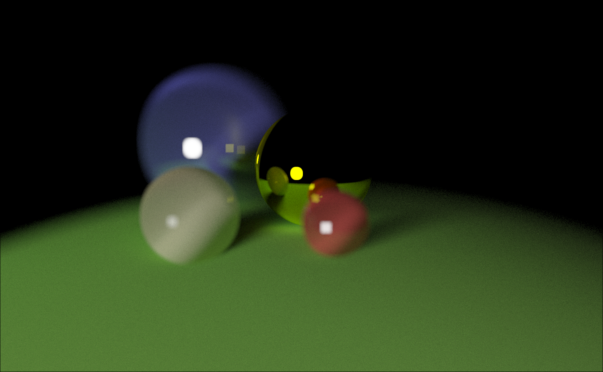

# raytracing



This is my first raytracer. It is missing a BVH, but i might extend this project later.

In order to lock the mouse press escape. Move with wasd and mouse.

# building
uses cmake:
``` shell
cmake -S . -B build
cmake --build build
build/main # important for cwd path to be in the project root
```